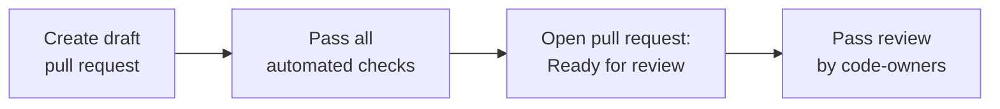

# Contributing to ts-libs

Thanks for contributing! These guidelines apply to internal and external contributors, including agents. Please read fully before opening a pull request.

> [!IMPORTANT]
> We are currently accepting bug fixes and invited contributions only. Feature PRs that do not align with our roadmap will be closed without extensive review.

## Getting Started

1. External contributors should fork the repository.
2. Create your branch from `develop`.
3. Follow the [README](README.md) to set up locally (`mise install`, `pnpm install`).

## Branch & Commit Conventions

### Branch naming

| Prefix | When to use |
|--------|-------------|
| `feat/` | Adding a new library or feature |
| `bugfix/` | Fixing a bug |
| `support/` | Refactors, tests, CI, tooling improvements |
| `chore/` | Maintenance, config, dependency updates |

### Commit messages

We follow [Conventional Commits](https://www.conventionalcommits.org/).

```
<type>(<scope>): <description>
```

Scope is the library name or area: `logs`, `devices`, `ci`, `deps`, etc.

### Rebase & merge strategy

Always prefer rebasing on `develop` before opening a PR.

## The PR Lifecycle

Open your PR as a **Draft** and pass all automated checks before making it **Ready for Review**.



### Automated checks

Before marking your PR ready for review, ensure all of the following pass:

- **format** — `pnpm format`
- **lint** — `pnpm lint`
- **typecheck** — `pnpm typecheck`
- **tests** — `pnpm test`
- **Copilot** — request a Copilot review, address or explicitly dismiss every comment, and resolve all threads.

### Ready for review

- Click **"Ready for review"** to convert from Draft — this automatically requests the relevant code owners via `CODEOWNERS`.
- When a reviewer leaves feedback and you push a fix, **re-request their review** (GitHub "Re-request" button).

## Changelogs

We use [changesets](https://github.com/changesets/changesets) for versioning. Run:

```bash
pnpm changelog
```

A changeset is **required** for any change to a library's public API or behavior.

## Adding a New Library

Use the `/import-lib-from-live` skill (for migrations from ledger-live) or follow the conventions in [AGENTS.md](AGENTS.md):

- `libs/<name>/src/` — source files
- `package.json` — use `catalog:` for all shared devDependencies
- `tsconfig.json` — extends `../../tsconfig.base.json`, includes `declaration: true`
- Scripts: `build`, `lint`, `typecheck`, `test`, `clean`

## Appendix: Tips

#### Request Copilot while still in Draft

> [!TIP]
> 

#### Re-request review after pushing fixes

> [!TIP]
> 
