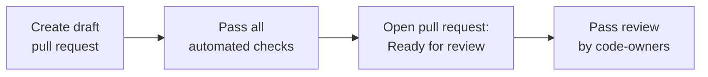
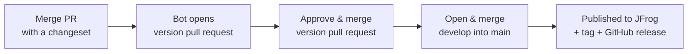

# Contributing to ts-libs

`ts-libs` is an internal Ledger monorepo that hosts reusable TypeScript libraries extracted from `ledger-live` and other Ledger stacks. These guidelines apply to contributors and agents. Please read fully before opening a pull request.

> [!IMPORTANT]
> The primary activity here is **migrating libraries from `ledger-live`** — not creating new ones from scratch. PRs that introduce libraries unrelated to the Ledger ecosystem or that duplicate packages already handled in `ledger-live` will be closed without extensive review.

## Getting Started

1. Create your branch from `develop`.
2. Run `mise install` to get the correct toolchain (node, pnpm, gitleaks, hk…).
3. Run `pnpm install` to install dependencies.
4. Git hooks activate automatically after `mise install` (pre-commit: format check + secret scan).

## Branch & Commit Conventions

### Branch naming

| Prefix | When to use |
|--------|-------------|
| `feat/` | Migrating a new library from ledger-live |
| `bugfix/` | Fixing a bug in an existing library |
| `support/` | Refactors, tests, CI, tooling improvements |
| `chore/` | Maintenance, config, dependency updates |

### Commit messages

We follow [Conventional Commits](https://www.conventionalcommits.org/). Format:

```
<type>(<scope>): <description>
```

Scope is the library name or area: `logs`, `devices`, `ci`, `deps`, etc.

### Rebase & merge strategy

Always rebase on `develop` before opening a PR. On a draft branch, prefer amend + `git push --force-with-lease origin <branch>` over accumulating fix commits.

## The PR Lifecycle

Open your PR as a **Draft** and pass all automated checks before making it **Ready for Review**.



### Automated checks

Before marking your PR ready for review, ensure all of the following pass:

- **format** — `pnpm format`
- **knip** — `pnpm knip` (no unused files or exports)
- **lint** — `pnpm lint`
- **typecheck** — `pnpm typecheck`
- **tests** — `pnpm test`
- **Copilot** — request a Copilot review, address or explicitly dismiss every comment, and resolve all threads.

### Ready for review

- Click **"Ready for review"** to convert from Draft — this automatically requests the relevant code owners via `CODEOWNERS`.
- When a reviewer leaves feedback and you push a fix, **re-request their review** (GitHub "Re-request" button).

## Changelogs

We use [changesets](https://github.com/changesets/changesets) for versioning. Run:

```bash
pnpm changelog
```

A changeset is **required** for any change to a library's public API or behaviour. It is not required for tooling, CI, or documentation-only changes.

> [!NOTE]
> On Changesets v3 there is no longer a confirmation prompt at the end of `changeset add` — the file is written immediately. To change your mind, edit or delete the generated `.changeset/*.md` file.

You can also skip the prompts entirely:

```bash
pnpm changeset add --minor @ledgerhq/logs -m "Add LocalTracer.withUpdatedContext"
```

`--major`, `--minor` and `--patch` accept comma-separated package names.

## Releases

Releases are automated. You do not run `changeset version` or `changeset publish` by hand.



1. Merging any PR carrying a changeset into `develop` makes the release bot open or update a **`chore(release): version packages`** pull request on the `changeset-release/develop` branch. It applies every pending changeset — bumping versions and writing `CHANGELOG.md` entries.
2. That PR is the release gate. Review the versions and changelogs, then approve and merge it like any other PR.
3. Open a pull request from `develop` into `main` and merge it. That push to `main` publishes the packages to JFrog, pushes git tags and creates GitHub releases.

Merge those two in that order. Merging `develop` into `main` while the version pull request is still open fails the release with an "unconsumed changesets" error rather than publishing unversioned packages.

To cut a release, merge the version pull request and then promote. To hold one back, leave the version pull request open — it keeps updating itself as more changesets land.

> [!NOTE]
> For the machinery behind this — what each workflow does, which registries and credentials it uses, and what to do when a release fails — see [docs/RELEASE.md](docs/RELEASE.md).

## Migrating a Library from ledger-live

Use the `/import-lib-from-live` skill. It handles discovery, dependency audit, file copy, config patching, and build verification. Once imported, set the library status in its README (see below).

## Library status

Every library README must carry a status block immediately after the title:

| Status | Alert | Meaning |
|---|---|---|
| `STABLE` | `[!NOTE]` | Production-ready, actively maintained, semver guaranteed |
| `DEPRECATED` | `[!WARNING]` | Superseded — migration path documented in the block |
| `UNSTABLE` | `[!CAUTION]` | API not stable, breaking changes possible without a major bump |

Example for a deprecated library:

```markdown
> [!WARNING]
> **Status: DEPRECATED**
> Use [`@ledgerhq/replacement`](link) instead.
```

## Appendix: Tips

#### Request Copilot while still in Draft

> [!TIP]
> 

#### Re-request review after pushing fixes

> [!TIP]
> 
