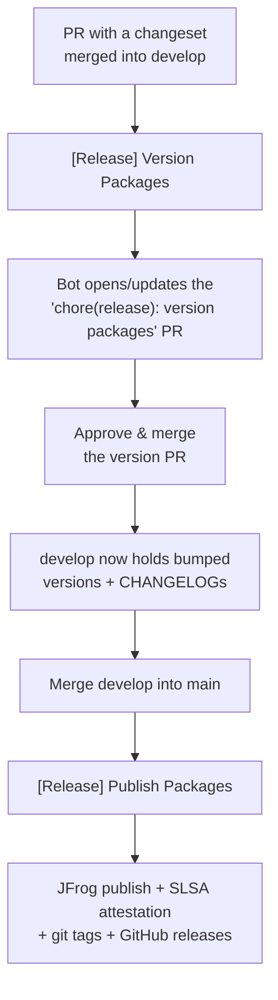

# Release Process

How `ts-libs` gets from a merged pull request to a published `@ledgerhq/*` package.

Contributors only need the short version in [CONTRIBUTING.md](../CONTRIBUTING.md#releases). This document is the reference for maintainers: what each workflow does, what credentials it uses, and what to do when a release fails.

## At a glance

| | |
|---|---|
| Versioning tool | [changesets](https://github.com/changesets/changesets) v3, config in [`.changeset/config.json`](../.changeset/config.json) |
| Base branch | `develop` |
| Publish branch | `main` |
| Registry | JFrog Artifactory (`ledgerlive-npm-prod-public`) |
| Tags / releases | `@ledgerhq/<name>@<version>`, one per published package |
| Bot identity | `live-github-bot[bot]`, via a GitHub App token |

Nobody runs `changeset version` or `changeset publish` by hand. Both are driven by workflows.

## The two-merge flow

A release takes two merges, in this order.



The order matters. Merging `develop` into `main` while the version PR is still open fails the publish with an *unconsumed changesets* error rather than publishing unversioned packages — see [Guard: unconsumed changesets](#guard-unconsumed-changesets).

To hold a release back, leave the version PR open. It keeps updating itself as more changesets land.

## Stage 1 — Version PR

[`.github/workflows/release-version.yml`](../.github/workflows/release-version.yml) · `[Release] Version Packages`

Triggered by every push to `develop`, plus `workflow_dispatch`.

`changesets/action` runs with **no** `publish-script`. With changesets present it enters version mode: it applies every pending `.changeset/*.md`, bumps `package.json` versions, writes `CHANGELOG.md` entries, deletes the consumed changeset files, and force-pushes the result to the `changeset-release/develop` branch, opening or updating the `chore(release): version packages` pull request. With no changesets present it returns early and does nothing.

That PR is the release gate. Review the version bumps and changelog entries, then approve and merge it like any other PR.

### Why an App token, not `GITHUB_TOKEN`

Pull requests opened with `GITHUB_TOKEN` do not trigger workflows. The version PR would therefore never get the `CI` check that develop's ruleset requires, and would be permanently unmergeable. The workflow mints a `live-github-bot[bot]` token via `actions/create-github-app-token` instead, scoped to `contents: write` and `pull-requests: write`.

Do **not** add a `GITHUB_TOKEN` env var to the `changesets/action` step — it throws if one is set and differs from `github-token`. The action injects the app token into the version script itself, which is how `@changesets/changelog-github` authenticates.

### Why `fetch-depth: 0`

`@changesets/changelog-github` resolves the commit that added each changeset file in order to attribute the changelog entry to its author and PR. A shallow clone breaks that.

### Skipping the version PR merge-back

Merging `changeset-release/develop` back into `develop` is itself a push to `develop`, which would re-trigger this workflow for a run with nothing left to version. A job-level `if` skips it:

```yaml
if: >-
  !startsWith(github.event.head_commit.message, 'chore(release): version packages')
  && !contains(github.event.head_commit.message, 'changeset-release/')
```

It is keyed on the commit message, not on `github.actor`: a merge commit is attributed to whoever clicked merge, not to the bot. The two clauses cover all three merge methods the ruleset allows:

| Merge method | Head commit message |
|---|---|
| Merge commit | `Merge pull request #N from LedgerHQ/changeset-release/develop` |
| Squash | `chore(release): version packages (#N)` |
| Rebase | `chore(release): version packages` |

Both strings are set by this same workflow's `commit-message` and `pr-title` inputs, so they stay in sync. `workflow_dispatch` still runs — `head_commit` is null there, so both checks are false.

A `[skip ci]` marker in the changesets commit message would be simpler, but it also suppresses `pull_request` runs, so the version PR would never get its required `CI` check.

## Stage 2 — Publish

[`.github/workflows/release.yml`](../.github/workflows/release.yml) · `[Release] Publish Packages`

Triggered by every push to `main`, plus `workflow_dispatch`. Runs in the `release` GitHub environment, which is where `ARTIFACTORY_PUBLISH_URL` lives.

Steps, in order:

1. **Guard: unconsumed changesets** — see below.
2. **Build** — `pnpm build`. Must precede packing; the tarballs include `lib/` and `lib-es/`.
3. **Require a publish registry** — fails if `ARTIFACTORY_PUBLISH_URL` is empty. The `jfrog-npm-auth` action skips silently on an empty registry, which would otherwise leave npm pointed at the *read* registry and publish the release there.
4. **Pack** — `changeset pack --out-dir <tmp>`. Derives its work from the publish plan, so packages already present in the registry are skipped and nothing is packed for them. It writes `publish-plan.json` even when the plan is empty, which keeps a re-run idempotent.
5. **Attest** — SLSA provenance over every tarball, skipped when nothing was packed (the action exits 1 on an empty `subject-path`).
6. **Publish, tag and release** — `changeset publish --from-pack-dir <tmp>` publishes the exact tarballs that were attested, then pushes git tags and creates GitHub releases through the API.

Tags and releases go through the API rather than the git CLI (`push-with-git-cli` defaults to false), so GitHub signs the commits — both `develop` and `main` require signed commits.

### Guard: unconsumed changesets

`changesets/action` enters version mode whenever changesets are present, *even with a `publish-script` set*. On `main` that would open a spurious `changeset-release/main` pull request instead of publishing. A shell step therefore fails the run up front if any `.changeset/*.md` other than `README.md` survives:

```
main has N unconsumed changeset(s): … Merge the 'chore(release): version packages'
pull request on develop first, then merge develop into main.
```

Unconsumed changesets on `main` mean `develop` reached `main` before its version PR was merged. Fix it on `develop`, not on `main`.

## Registries and credentials

| Name | Scope | Value / purpose |
|---|---|---|
| `ARTIFACTORY_URL` | repo variable | **read** registry, used by every workflow that installs |
| `ARTIFACTORY_PUBLISH_URL` | `release` environment variable | **write** registry, publish only |
| `NPM_SANDBOX_REGISTRY` | repo variable (unset) | sandbox target; defaults to `ledgerlive-npm-sandbox-green` |
| `RELEASE_RUNNER` | repo variable (unset) | defaults to `public-ledgerhq-shared-medium` |
| `GH_BOT_APP_ID` / `GH_BOT_PRIVATE_KEY` | repo secrets | GitHub App credentials for `live-github-bot[bot]` |

Authentication to JFrog is **OIDC**, never a static token. Every job that talks to Artifactory needs `id-token: write` and goes through [`.github/actions/jfrog-npm-auth`](../.github/actions/jfrog-npm-auth/action.yml), which performs the OIDC login and writes `~/.npmrc`.

The publish job authenticates **twice**: once against the read registry to install dependencies, then again against `ARTIFACTORY_PUBLISH_URL` immediately before packing. The second call is what redirects `npm publish`.

## Changeset configuration

From [`.changeset/config.json`](../.changeset/config.json):

- `baseBranch: develop` — changesets diff against `develop`, not `main`.
- `access: public` — packages publish with `--access public`.
- `changelog: @changesets/changelog-github` — changelog entries link the PR and author, which is why the version job needs full history and an authenticated token.
- `format: oxfmt` — generated `CHANGELOG.md` and `package.json` edits are formatted with the repo's formatter, so they pass `pnpm format`.
- `updateInternalDependencies: patch` + `bumpVersionsWithWorkspaceProtocolOnly: true` — a bump to one library patch-bumps only the libraries that depend on it through the `workspace:` protocol.

## Sandbox publish (dry run)

[`.github/workflows/sandbox-publish.yml`](../.github/workflows/sandbox-publish.yml) · `[Test] Sandbox Publish`

Manual only. Builds and runs `changeset publish --tag sandbox` against `ledgerlive-npm-sandbox-green` (override with the `registry` input). Use it to validate packaging changes — tarball contents, `exports` maps, `files` globs — without touching the production registry or creating tags.

It publishes whatever versions are currently in the working tree, so run it from a branch where versions have already been bumped if you want to test a specific version.

## Runbook

**The version PR did not appear after merging a changeset.**
Check that the `[Release] Version Packages` run was not skipped by the merge-back `if`. If your PR title happened to start with `chore(release): version packages`, or the branch name contained `changeset-release/`, the guard swallowed it. Re-run the workflow manually (`workflow_dispatch`) — the guard does not apply to dispatch.

**The version PR has no `CI` check and cannot merge.**
The app token was not used, so the PR was opened by `GITHUB_TOKEN`. Verify `GH_BOT_APP_ID` and `GH_BOT_PRIVATE_KEY` are set and the app is still installed on the repo. Closing and reopening the PR does not help; push an empty commit to the branch or re-run the workflow.

**Publish failed with "main has N unconsumed changeset(s)".**
`develop` reached `main` before the version PR merged. Merge the version PR on `develop`, then merge `develop` into `main` again. Do not delete the changeset files on `main`.

**Publish failed with "ARTIFACTORY_PUBLISH_URL is not set on the 'release' environment".**
The variable was removed or the job lost its `environment: release`. Without it the job would have published to the read registry — the guard is doing its job.

**Publish failed partway through.**
Re-run the workflow. `changeset pack` derives its work from the publish plan, so packages already in the registry are skipped and only the missing ones are packed, attested and published. Tags and releases are likewise created only for what publishes.

**A package published but has no git tag or GitHub release.**
The publish succeeded and the tagging step failed after it. Re-running is safe: the already-published package drops out of the plan, but `changeset publish` still creates the missing tag and release.

## Changing the release workflows

- Actions are **pinned by commit SHA** with the version in a trailing comment. Keep it that way; `zizmor` enforces it. The one exception is the `LedgerHQ/*` policy, which permits a ref pin.
- Validate locally before pushing — `actionlint` and `zizmor` are both in [`mise.toml`](../mise.toml) and run on the toolchain installed by `mise install`.
- Changing the `commit-message` or `pr-title` inputs in `release-version.yml` means changing the merge-back `if` condition to match.
